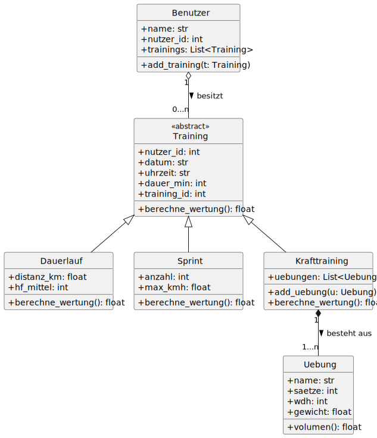
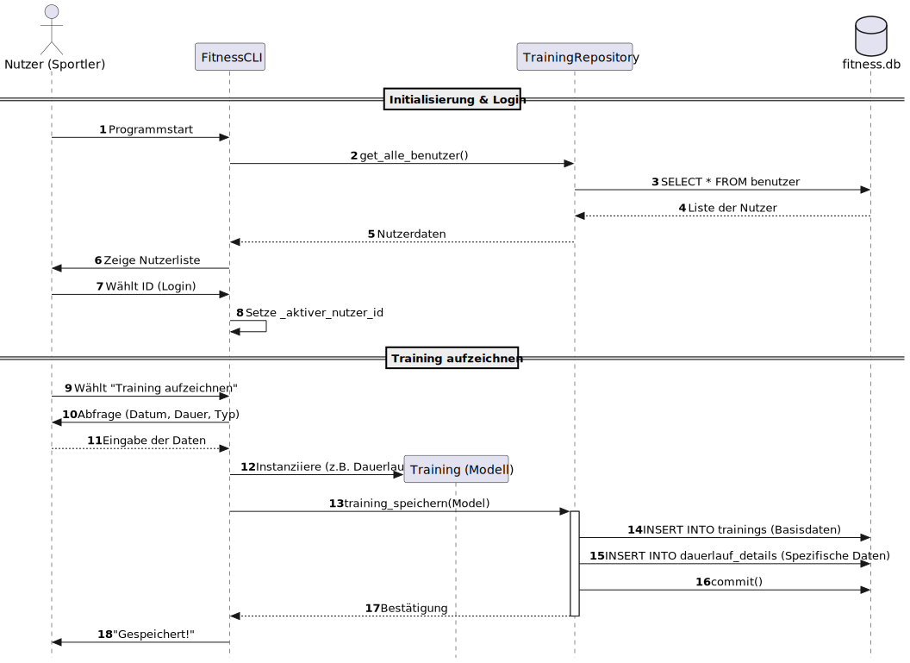

# Fitness-Tracker CLI

Ein Python-basiertes Command-Line-Interface zur Dokumentation und Analyse sportlicher Leistungen. Das Tool wurde mit Fokus auf eine modulare Architektur (**Separation of Concerns**) und eine optimierte Benutzererfahrung bei der Dateneingabe entwickelt.

## Key Features

* **Multi-User-System:** Verwaltung getrennter Profile mit individuellen Trainingsverläufen.
* **Differenzierte Trainingsarten:** Spezifische Erfassung für Dauerlauf, Sprint und Krafttraining.
* **Intelligentes Scoring:** Automatische Berechnung einer Wertung basierend auf Leistungsparametern (Dauerlauf-Pace, Krafttraining-Volumen und Sprint-Maximalgeschwindigkeit).
* **Analyse-Tools:** Fortschrittsberichte über Wochen-Zusammenfassungen, Volumen-Progression und Pace-Entwicklung.
* **Datenintegrität:** Einsatz von SQLite mit Foreign Key Constraints und robuster Eingabevalidierung.

## Tech Stack

* **Sprache:** Python 3.x
* **Datenbank:** SQLite3
* **Bibliotheken:** `tabulate` (CLI-Formatierung), `pytest` (Testing)

---

## Schnellstart

Um das Projekt ohne manuelles Eintippen von Daten sofort testen zu können, ist ein Demo-Skript enthalten:

1.  **Abhängigkeiten installieren:**
    ```bash
    pip install -r requirements.txt
    ```
2.  **Demo-Daten generieren:**
    ```bash
    python setup_testdata.py
    ```
    *Erstellt eine `fitness.db` mit einem aktiven Nutzer ("Max Mustermann") und Beispiel-Trainings.*
3.  **Anwendung starten:**
    ```bash
    python cli.py
    ```

---

## Projektstruktur

* `cli.py`: Präsentationsschicht & Menüführung.
* `repository.py`: Data Access Layer (Kapselung der SQL-Logik).
* `models.py`: Domänenmodelle & Geschäftslogik (OOP-Struktur der Trainingsarten).
* `schema.sql`: Initiales Datenbank-Design (DDL) inklusive Relationen und Cascades.
* `setup_testdata.py`: Utility-Skript zur schnellen Generierung einer Testumgebung.
* `requirements.txt`: Liste der externen Abhängigkeiten für eine einfache Installation.
* `docs/`: Dokumentation der Programmstruktur (UML-Diagramme als SVG und PlantUML-Quelle).
* `tests/`: Verzeichnis mit Unit- und Integrationstests zur Sicherstellung der Code-Qualität.

---

## Design-Entscheidungen (Highlights)

### UX-Optimierung (Nummernblock-Eingabe)
Besonderes Augenmerk liegt auf der Effizienz der Dateneingabe. Die Validierungsmethoden in der `cli.py` bereinigen Trennzeichen automatisch. Das erlaubt die Eingabe von Datum und Uhrzeit ohne Sonderzeichen (z. B. `20260427` statt `2026-04-27`) und somit ist die Nutzung des Nummernblocks für einen Großteil der Nutzer-Interaktionen mit der App ausreichend.

### Datenintegrität & Kaskadierung
Durch konsequente Nutzung von `FOREIGN KEY` Constraints und `ON DELETE CASCADE` im Datenbankschema wird sichergestellt, dass beim Löschen eines Benutzers oder Trainings keine verwaisten Einträge in den Detail-Tabellen verbleiben.

### Defensive Programmierung
Alle numerischen Eingaben werden auf logische Korrektheit geprüft (z. B. Ausschluss von Nullwerten bei Divisionen), um Laufzeitfehler wie `ZeroDivisionError` oder `TypeError` bei der Analyse-Berechnung zu verhindern.

---

## Architektur & Dokumentation

Das Projekt folgt klaren Design-Patterns, um Wartbarkeit und Erweiterbarkeit zu garantieren. Die Struktur ist in den folgenden Diagrammen visualisiert:

### Domänenmodell (Klassendiagramm)
Die Geschäftslogik ist streng objektorientiert abgebildet. Dabei werden Konzepte wie **abstrakte Basisklassen**, **Vererbung** (Spezialisierung der Trainingsarten) und **Komposition** (Krafttraining als Aggregator für Übungen) konsequent genutzt.



### System-Ablauf (Sequenzdiagramm)
Der Prozessfluss zeigt die saubere Trennung zwischen der Benutzeroberfläche (`CLI`), dem Datenzugriff (`Repository`) und der Persistenzschicht (`SQLite`). Die `CLI` kommuniziert dabei nie direkt mit der Datenbank, sondern nutzt das Repository als Vermittler (Kapselung).



---

## Testing

Die Testsuite im Ordner `tests/` stellt die Stabilität der Kernfunktionen sicher:

* `test_models.py`: Unit-Tests für die Berechnungslogik (Scoring-Formeln).
* `test_repository.py`: Datenbank-Tests (CRUD-Operationen und Joins).
* `test_integration.py`: Überprüfung des Zusammenspiels zwischen Repository und Modellen.
* `check_schema.py`: Validierung der aktuellen Tabellenstruktur gegen die `schema.sql`.

**Tests ausführen:**
```bash
python -m pytest tests/ -v
```

---

## Lizenz

Dieses Projekt wurde zu Bildungszwecken im Rahmen eines Portfolios erstellt.
Frei zur Nutzung und Modifikation.
